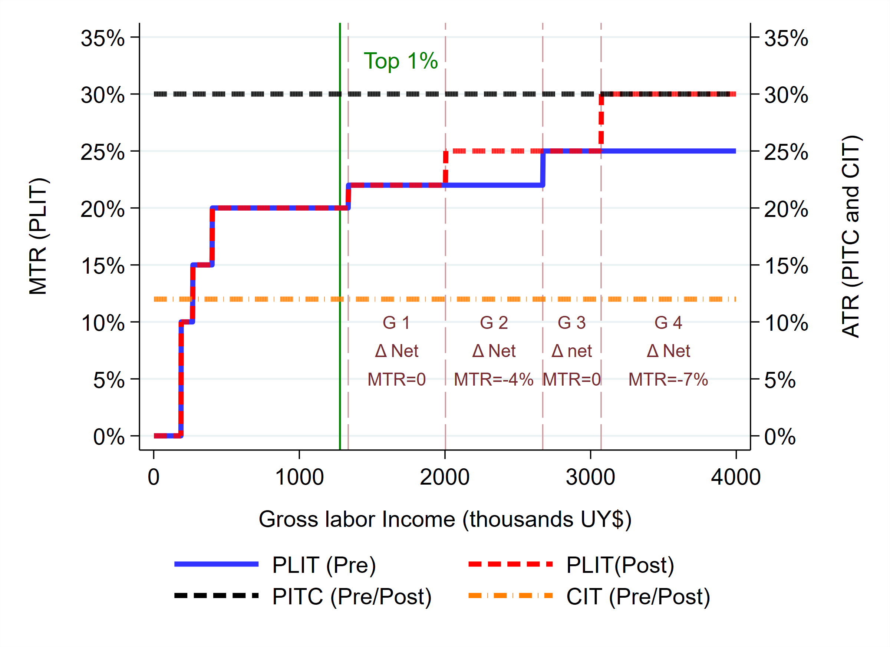

---

##### Download

+ [Paper](https://papers.ssrn.com/sol3/papers.cfm?abstract_id=4007698)
<!-- + [Online appendix](appendix1.pdf)
+ [Code and data](https://github.com/pmichaillat/job-rationing) -->

---

##### Abstract

This paper presents new evidence on how top-income earners react to personal income taxation, uncovering the different margins of responses. By combining rich administrative records and variation in the tax rates for the top 1\% income earners induced by a tax reform in Uruguay, we estimate an intensive margin elasticity of 0.577, partially explained by a real labor supply adjustment. Responses on the extensive margin are larger (semi-elasticity of 2.479), driven mainly by labor-to-corporate income shifting (semi-elasticity of -1.967). Our welfare analysis suggests that the efficiency losses associated with the reform represent at most 31\% of the projected increase in tax revenue, implying that the new top tax rates are on the ``correct'' side of the Laffer curve.

---

##### Figure: Marginal and Average Tax Rate - Uruguay 2012



<!-- ---

##### Citation

Author. Year. "Title." *Journal* Volume (Issue): First page–Last page. https://doi.org/paper_doi.

```BibTeX
@article{AAYY,
author = {Author},
doi = {paper_doi},
journal = {Journal},
number = {Issue},
pages = {XXX--YYY},
title ={Title},
volume = {Volume},
year = {Year}}
``` -->
<!-- 
---

##### Related material

+ [Presentation slides](presentation1.pdf)
+ [Dissertation title](https://escholarship.org/uc/item/7jr3m96r) – PhD dissertation on which this paper is based.
+ [Column title](https://cep.lse.ac.uk/pubs/download/cp365.pdf) – Nontechnical column describing the paper. -->

